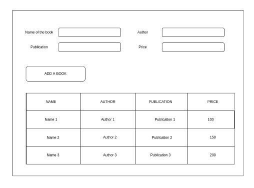

# Problem Statement: Create a Book Management Application
 
### Use below image for UI visualisation and understanding the problem
 

### Requirements:

 - When a user enters data into the input box, and clicks the "Add A Book" Button, the book details goes into the table below
 - Do not allow a blank book item to be filled in the list, all the fields are required. Not one should be left blank
 - Make a table where books are added on each button click
 - Each book item in the table will occupy a row
 - Use Bootstrap Grid for aligning UI elements
 - You are allowed to use Bootstrap components
 - Use your UX ideas to make the application responsive for mobile screens